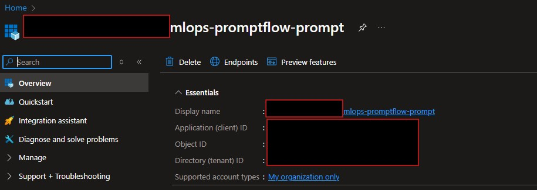
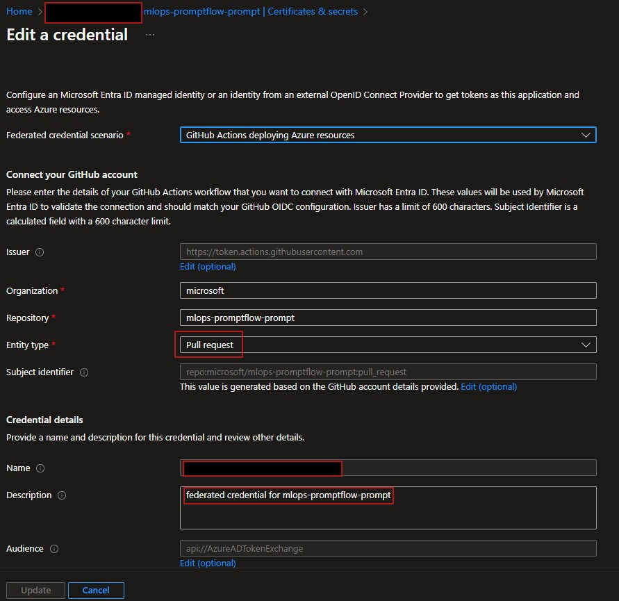
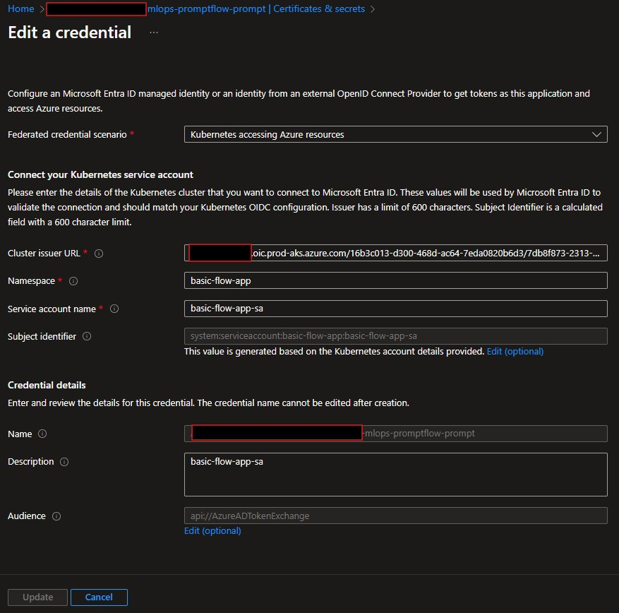
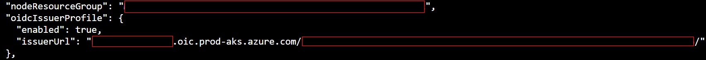
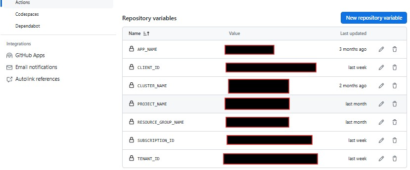
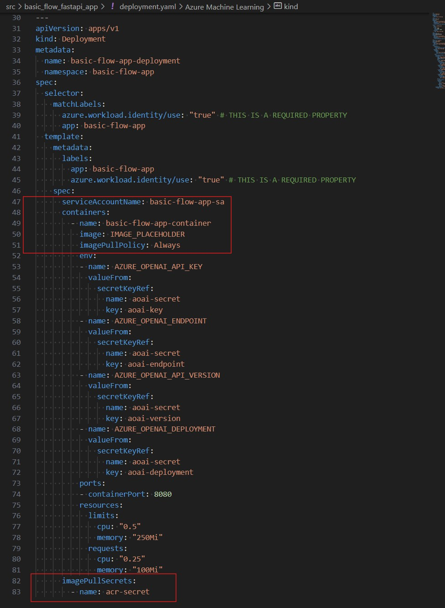

## How to configure OpenID Connect Federated Credentials with Azure for GitHub Actions Workflows
OpenID Connect (OIDC) Federated Credentials allow GitHub Actions workflows to securely authenticate with Azure services without needing to store long-lived secrets or credentials. This is achieved by leveraging the OIDC protocol to establish trust between GitHub and Azure. GitHub's OIDC provider works with Azure's workload identity federation [Microsoft:Workload-identity-federation](https://learn.microsoft.com/en-us/entra/workload-id/workload-identity-federation). Microsoft Entra Workload ID integrates with the capabilities native to Kubernetes to federate with external identity providers. For the detailed documentation follow: 
* [Overview Microsoft Entra Workload ID with AKS](https://learn.microsoft.com/en-us/azure/aks/workload-identity-overview?tabs=dotnet) 
* [Use GitHub Actions to connect to Azure](https://learn.microsoft.com/en-us/azure/developer/github/connect-from-azure?tabs=azure-portal%2Clinux) 


* ### Step 1: Register a Microsoft Entra Application
    1. Register a Microsoft Entra Application.
    2. Assign a role to the application.
    3. Add a Role Assignment `Contributor` (select "Add User, group or service principal"), and search for your Application.
    Assign a role to the application. 
    Make sure to add a Role Assignment(select Add User, group or service principal) , and search for your Application. 
    4. Take note of the Client ID and Tenant ID. 
    


* ### Step 2: Federated Credentials
    1. Once the managed identity is provisioned, go to App registrations and select `Certificates & secrets` under Manage section.
    2. Add federated credentials to trust tokens issued by GItHub Actions: In this section, you will need to add two federated credentials. The Entity Type is used to define the scope of the OIDC requests from GitHub Workflows. Options are Environment, Branch, Pull request, Tag. To set up Federated Credential, click "Add Credential":

    - 2.1. ``Github Actions deploying Azure resources``

    Begin by filling in necessary fields (Organization, Repository, set Entity Type: Pull request)
    


    - 2.2. ``Kubernetes accessing Azure resources``
        Begin by filling in necessary fields, namespace, service account details associated with container. Make sure to specify the service account, namespace associated with your deployment. 
        

        For the OIDC Issuer, run following command in Azure Cloud shell to retrieve the OIDC issuer URL
        * `az aks update -g mlops-promptflow-prompt -n aks-prompt-promptflow --enable-oidc-issuer` . Take a note of the "issuerUrl", and use the URL in "Cluster URL field". By default, the issuer is set to use the base URL https://{region}.oic.prod-aks.azure.com/{tenant_id}/{uuid}, where the value for {region} matches the location to which the AKS cluster is deployed. The value {uuid} represents the OIDC key, which is a randomly generated guid for each cluster that is immutable.

        
        Refer to the documentation for more details: [OpenID Connect for AKS](https://learn.microsoft.com/en-us/azure/aks/use-oidc-issuer), [Workload-identity-deploy-cluster](https://learn.microsoft.com/en-us/azure/aks/workload-identity-deploy-cluster)


* ### Step 3: Create GitHub Secrets/Variables
    Create GitHub secrets/variables to store sensitive information.
    

* ### Step 4: Use OpenID Connect Azure CLI to authenticate with the Azure login action.

    Service principe federated identity is ready. Here, we are going to add setup for the basic_flow_ci.yaml pipeline workflow job run_aks-deployement with Github Action to generate OIDC token, which azure/loging@v2 will pick up and exchange against AAD. 

    Start by adding perissions, azure/login@v1 action and AKS step kubelogin for non-interactive authentication

* ``basic_flow_ci.yaml``
    ```
    permissions:
    id-token: write
    contents: read

    jobs:
    run-aks-deployment:
        runs-on: ubuntu-latest
        needs: run-evaluation-full

      - name: 'Az CLI login'
        uses: azure/login@v1
        with:
            client-id: ${{ env.CLIENT_ID }}
            tenant-id: ${{ env.TENANT_ID }}
            subscription-id: ${{ env.SUBSCRIPTION_ID }}

      - name: Setup kubectl
        id: install-kubectl
        uses: azure/setup-kubectl@v3

      - name: Setup kubelogin
        uses: azure/use-kubelogin@v1
        with:
          kubelogin-version: 'v0.0.26'

      - name: Set AKS context
        uses: azure/aks-set-context@v3
        with:
          resource-group: ${{ vars.RESOURCE_GROUP_NAME }}
          cluster-name: ${{ vars.CLUSTER_NAME }}
          admin: 'false'
          use-kubelogin: 'true'
    ```


* ``deployment.yaml``
```
    ---
    kind: Namespace
    apiVersion: v1
    metadata:
    name: basic-flow-app
    ---
    apiVersion: v1
    kind: Service
    metadata:
    name: basic-flow-app-service
    namespace: basic-flow-app
    annotations: 
        azure.workload.identity/client-id: "{client-ID}"
    spec:
    type: LoadBalancer
    ports:
    - name: http
        port: 8080
        targetPort: 8080
    selector:
        app: basic-flow-app
    ---
    apiVersion: v1
    kind: ServiceAccount
    metadata:
    name: basic-flow-app-sa
    namespace: basic-flow-app
    annotations: 
        azure.workload.identity/client-id: "{client-ID}"
```
1. Create a Kubernetes service account and annotate it with the client-ID of the managed identity. `annotations: azure.workload.identity/client-id: "{client-ID}"` for the service account. 
2. Add `labels: azure.workload.identity/use: "true"` for template and spec.
3. Provide secret for kubectl to access ACR: `imagePullSecrets:- name: acr-secret`



Links:
* [Workload Identity Cluster](https://learn.microsoft.com/en-us/azure/aks/workload-identity-deploy-cluster)

* [Microsoft: AKS Use-oidc](https://learn.microsoft.com/en-us/azure/aks/use-oidc-issuer)