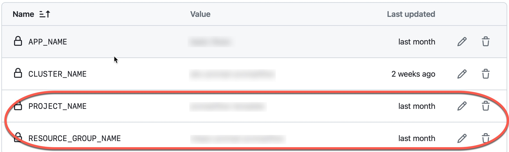
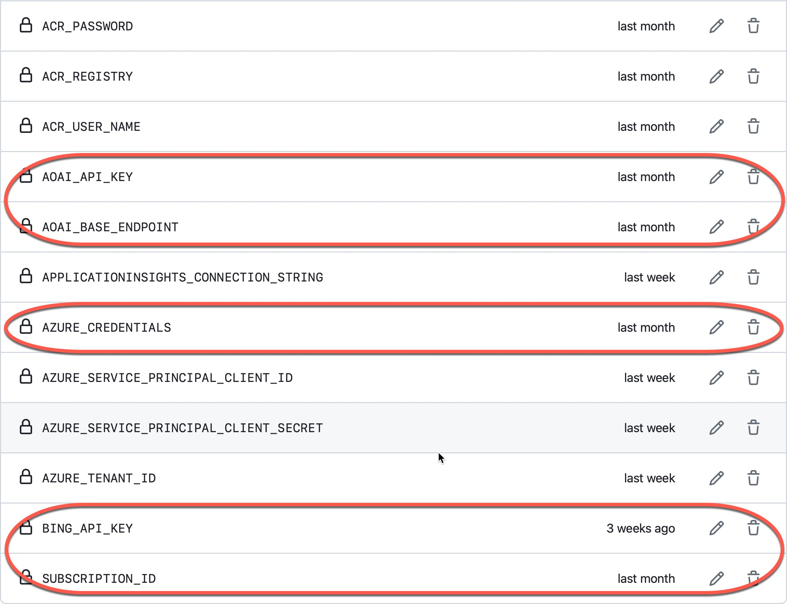
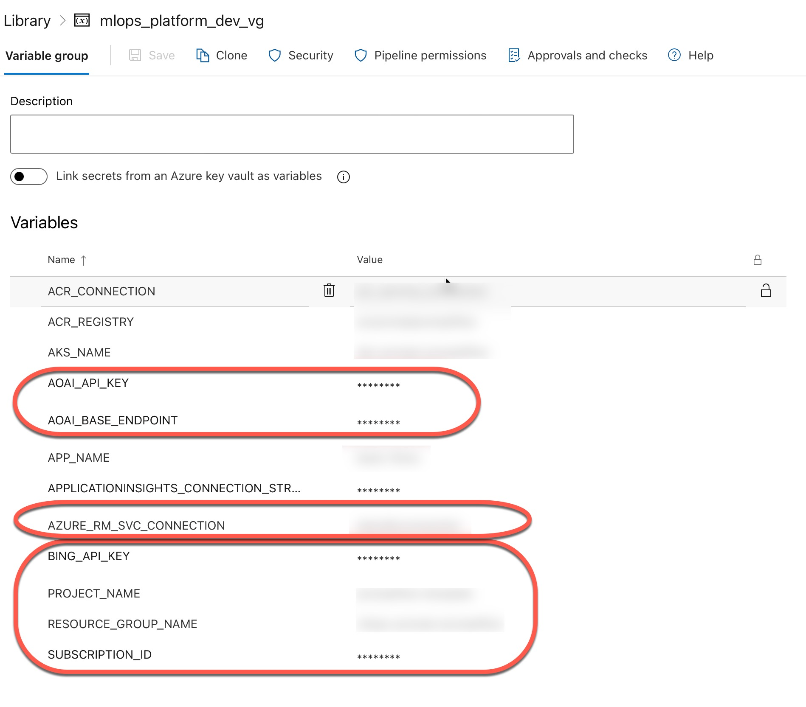

# MLOps for PromptFlow Workloads using AI Studio

This repository demonstrates how AI Studio and Prompt flow can be utilized in the Machine Learning Development and Operations (MLOps) process for LLM-based applications (aka LLMOps).

During the [Microsoft Build 2024 conference](https://build.microsoft.com/en-US/home), Azure AI Studio was announced in GA. Prompt flow also received several new features, including [Prompty](https://microsoft.github.io/promptflow/how-to-guides/develop-a-prompty/index.html), [traces](https://microsoft.github.io/promptflow/how-to-guides/tracing/index.html), [flex flows](https://microsoft.github.io/promptflow/how-to-guides/develop-a-flex-flow/index.html), an ability to [execute a DAG flow as a function](https://microsoft.github.io/promptflow/how-to-guides/execute-flow-as-a-function.html), and new [evaluation capabilities](https://github.com/microsoft/promptflow/tree/main/src/promptflow-evals). All these features bring additional opportunities for data scientists and software engineers in all aspects of MLOps, starting from the experimentation phase to deployment into production. 

The goal of this repository is to provide a good enough set of samples and “how to” instructions that can be used as a set of building blocks for real projects. The repository doesn’t recommend the only way to achieve your goals, and the building blocks can be picked based on your personal preferences (for example, it’s possible to develop the same flow using a function, class or YAML-based approaches) or based on available infrastructure or requirements.

## Folder Structure.

The repository has the following folders (provided in logical rather than alphabetic sequence):

-	**flows**: This folder contains several “toy” Prompt flow examples demonstrating various flow creation methods. Each example folder includes the flow itself and the associated evaluation script based on the new promptflow-evals package.
-	**mlops**: In this folder, you can find scripts demonstrating various techniques for invoking each Prompt flow example. Additionally, the folder contains some utility scripts that can be useful for creating connections, assigning names to experiments and completing some utility tasks for deployment.
-	**data**: The folder contains some JSONL files that the repo uses to demonstrate batch runs and evaluation for flows.
-	**src**: This folder contains independent custom evaluators and applications that demonstrate how to deploy flows for serving. Azure Functions and Kubernetes FastAPI applications are primary citizens here, but this list will be extended.
-	**config**: The repository is trying to demonstrate how to use Prompt flow and AI Studio in real projects. This means that it should be possible to configure flows with parameters that can be different in each environment (development, QA, production). That’s why the repository uses a configuration file in YAML format that includes all needed parameters per flow and environment. These parameters can be hardcoded in YAML or come from environment variables.
-	**.azure-pipelines** and **.github**: The folders contain Azure DevOps pipelines and GitHub workflows that can be used to verify code quality, run evaluations and deploy flows. You can pick between Azure DevOps and GitHub based on your preferences. The repository uses GitHub pipelines to run all the checks and validate deployment as part of the development process.
-	**.devcontainer**: The folder has a development container that can help you work at the repo. Alternatively, you can set up a local Conda environment.

Additionally, the root folder contains some important files:

-	**.env.sample**: The file should be renamed to .env file, and sensitive parameters (parameters that cannot be hardcoded in config.yaml) should be provided here.
-	**setup.cfg**: The repo uses strict rules to validate code quality using flake8. This file contains applied rules and exceptions.
-	**requirements.txt**: This file lists all packages that the repo is using for examples and quality checks.
-	**.amlignore**: If you run examples in Azure using serverless compute, this file allows you to deploy only the needed files remotely rather than everything in the root.

## Prompt flow Examples.

The repository shows three different flows; some are implemented using various approaches. Comparing implementations of the same flow should help you see differences.

-	**Entity extraction flow**: This basic flow can be implemented using all three methods (class, function, and YAML). So, implementations are separated into three folders: class_basic_flow, function_basic_flow, and yaml_basic_flow. We are using these flows as a primary “toy” example.
-	**Plan and execute flow**: This flow contains several steps that use autogen to build a chat flow. The flow is implemented as a class-based and YAML, and the folders class_plan_and_execute and plan_and_execute contain appropriate implementations.
-	**Chat with PDF**: The flow implements a chat flow with a document and is implemented as a DAG. It is located in the chat_with_pdf folder.
Each flow folder contains the flow itself, found in the standard folder, and the evaluation script in the evaluate folder.

## Local Environment.

Most of the scripts in the repository can be executed locally. We recommend setting up a separate Conda environment based on requirements.txt at the repo's root. [This document](./conda_environment.md) provides step-by-step instructions for setting up a local Conda environment. Additionally, we are providing a Docker image that can be used as a development environment in VS Code.

## Configuration and Local Run.

Azure OpenAI should be available to start running the flows locally. The following models should be deployed:

-	**Entity extraction flows**: gpt-35-turbo
-	**Chat with PDF**: gpt-35-turbo and text-embedding-ada-002
-	**Plan and execute**: gpt-35-turbo-16k and gpt-4o

Deployment names can be provided in config.yaml for each flow/environment you plan to execute. The parameters AOAI_BASE_ENDPOINT and AOAI_API_KEY should be provided in the .env file. To use Bing search as part of the plan, the plan and execution flows require BING_API_KEY. Having just these parameters, you can execute all the flows locally. It can be done from the root of the repo using the following commands:

```bash
python -m mlops.run_chat_with_pdf --environment_name pr –visualize
python -m mlops.run_class_basic_flow --environment_name pr --visualize
python -m mlops.run_class_plan_and_execute --environment_name pr --visualize
python -m mlops.run_function_basic_flow --environment_name pr --visualize
python -m mlops.run_yaml_basic_flow --environment_name pr --visualize
python -m mlops.yaml_plan_and_execute --environment_name pr --visualize
```

We use the **--visualize** parameter to open traces in your default browser. Skip this parameter if you don’t need this behaviour.

We use the **--environment_name** parameter to provide information about which section of the config.yaml file configuration parameters should be taken. For example, in the case of the class_basic_flow and pr environment, the class_basic_flow_pr section will be used. You can define your sections for QA, prod, and other environments.

**Pay attention** to the fact that each script shows how to invoke flow using several different methods, starting with an invocation on a single record and ending with batch execution. This is necessary to show how to use the flow in various scenarios.

An AI Studio project should be deployed to log traces into AI Studio and run evaluation. Add three more parameters into the .env file that is related to the project: SUBSCRIPTION_ID, RESOURCE_GROUP_NAME and PROJECT_NAME. Right after that, you can use the **--deploy_traces** parameter that will enable tracing deployment into the cloud:

```bash
python -m mlops.run_class_basic_flow --environment_name pr --deploy_traces
```

The following commands show how to execute evaluation flow for class_basic_flow in the pr environment:

```bash
python -m flows.class_basic_flow.evaluate.evaluate --environment_name pr
```

## Execution in the cloud.
Several scripts demonstrate how to run flow batches in Azure using serverless compute. To run these scripts, all required connections should be created in AI Studio, and their names should be provided in config.yaml.

Data can be used from a local disk or uploaded into AI Studio manually or using the register_data_assets.py script (or an AzDO pipeline or GitHub workflow register_data_assets.yml as part of the MLOps process). If you are using data in AI Studio, config.yaml should contain correct references to datasets in AI Studio.

The following command demonstrates how to invoke class_basic_flow in Azure as a batch:

```bash
python -m mlops.run_class_basic_flow_azure --environment_name pr
```

**Pay attention** to the fact that the new evaluation package doesn’t allow the execution of evaluations in the cloud now.

## DevOps Pipelines for Pull Requests.

Each flow has its own Azure DevOps pipeline and GitHub workflow that should be invoked for every Pull Request that affects the flow's code or related scripts. For example, for class_basic_flow, we have the class_basic_flow_pr.yml GitHub workflow. The workflow executes quality checks using flake8 and unit tests and evaluates the flow. This set of actions should be good enough for most projects to decide whether the PR may be approved.

Some variables should be provided to execute PR builds (primarily the same ones used in the .env file for local execution).
Repository variables:



Repository secrets:



In the case of Azure DevOps, we are using the mlops_platform_dev_vg variable group:




## CI DevOps Pipeline.

TODO: This content will be available shortly.

## How to...

TODO: This content will be available shortly.


## Contributing

This project welcomes contributions and suggestions.  Most contributions require you to agree to a
Contributor License Agreement (CLA) declaring that you have the right to, and actually do, grant us
the rights to use your contribution. For details, visit https://cla.opensource.microsoft.com.

When you submit a pull request, a CLA bot will automatically determine whether you need to provide
a CLA and decorate the PR appropriately (e.g., status check, comment). Simply follow the instructions
provided by the bot. You will only need to do this once across all repos using our CLA.

This project has adopted the [Microsoft Open Source Code of Conduct](https://opensource.microsoft.com/codeofconduct/).
For more information see the [Code of Conduct FAQ](https://opensource.microsoft.com/codeofconduct/faq/) or
contact [opencode@microsoft.com](mailto:opencode@microsoft.com) with any additional questions or comments.

## Trademarks

This project may contain trademarks or logos for projects, products, or services. Authorized use of Microsoft 
trademarks or logos is subject to and must follow 
[Microsoft's Trademark & Brand Guidelines](https://www.microsoft.com/en-us/legal/intellectualproperty/trademarks/usage/general).
Use of Microsoft trademarks or logos in modified versions of this project must not cause confusion or imply Microsoft sponsorship.
Any use of third-party trademarks or logos are subject to those third-party's policies.
